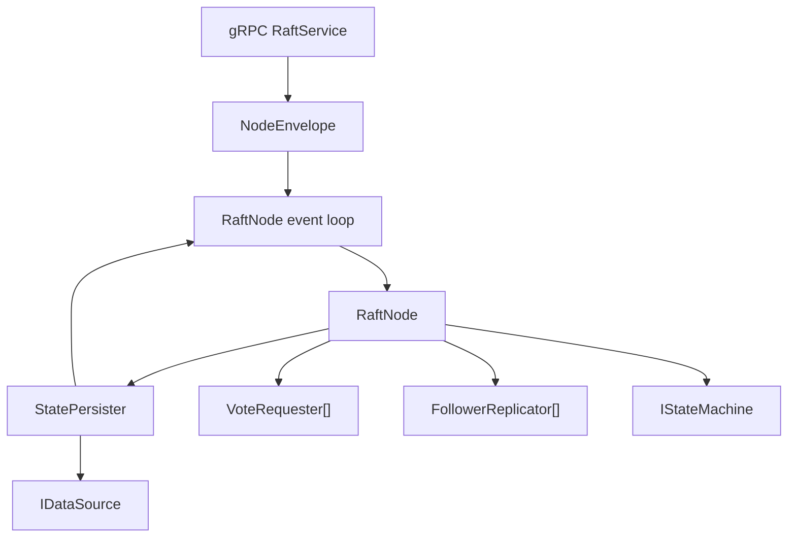
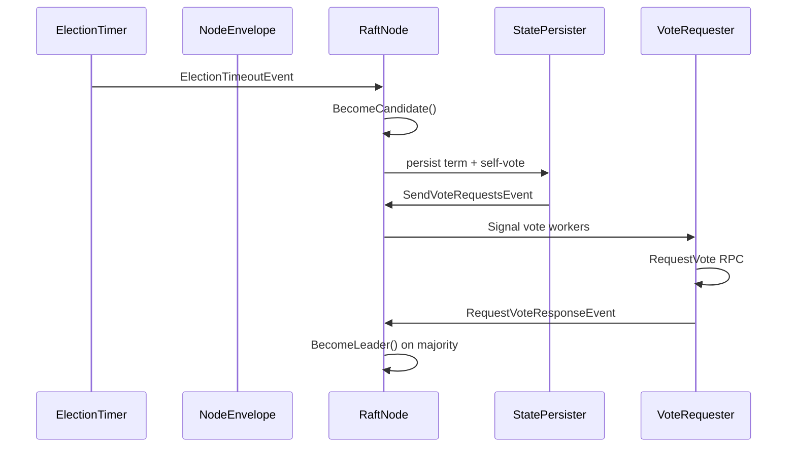
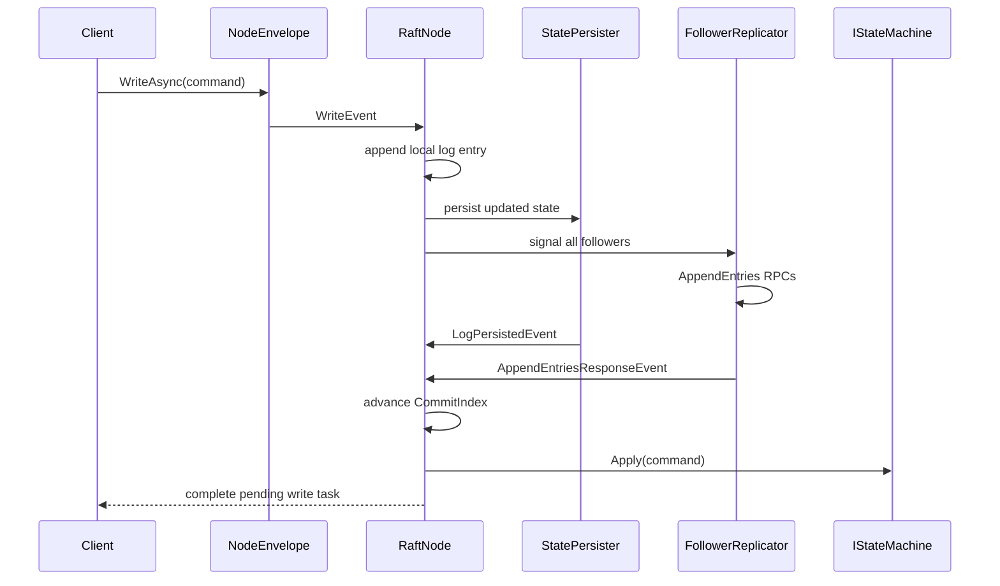

# Raft Architecture

This document describes the **Raft implementation in this repository**, not Raft in the abstract. It is meant to help you understand how the code is structured, how requests move through the system, and where the concurrency boundaries are.

## Design Summary

Each node is built around a **single-reader event loop** that owns Raft state transitions. Timers, inbound RPCs, client writes, persistence completions, and peer RPC responses are all converted into events and funneled through that loop. Outbound network work and disk persistence happen on separate background workers.

That split gives this implementation two useful properties:

- core Raft state changes happen serially inside `RaftNode`
- I/O-heavy work like persistence and RPC fan-out stays off the main state-transition path

## Main Components

| Component | Responsibility |
| --- | --- |
| `Raft/Messaging/NodeEnvelope.cs` | Runtime shell around a node. Owns timers, persistence, peer workers, inbound RPC entry points, and the event-processing loop. |
| `Raft/Core/RaftNode.cs` | Consensus core. Owns term, vote, log, commit/apply logic, role changes, and leader/candidate/follower behavior. |
| `Raft/Core/State.cs` | Persistent and volatile Raft state. |
| `Raft/Persistence/StatePersister.cs` | Serializes durable state writes through an async channel and emits follow-up events after durability. |
| `Raft/Replication/FollowerReplicator.cs` | One background worker per follower. Sends `AppendEntries` using the leader's current replication snapshot. |
| `Raft/Voting/VoteRequester.cs` | One background worker per peer. Sends `RequestVote` when a node is campaigning. |
| `Raft/Timers/ElectionTimer.cs` | Randomized election timeout that triggers `ElectionTimeoutEvent` when there has been no recent leader activity. |
| `Raft/Timers/HeartBeatTimer.cs` | Fixed-interval heartbeat trigger used only while the node is leader. |
| `Chubby/Services/NodeService.cs` | gRPC adapter that maps protobuf requests to the `IServer` Raft interface. |
| `Raft/Interfaces/IStateMachine.cs` | Application integration point. Committed log commands are applied here. |
| `Raft/Persistence/IDataSource.cs` | Storage integration point for durable Raft state. |

## Component Diagram

## Execution Model

### 1. Single-reader state machine core

`RaftNode` exposes an unbounded `EventChannel` with `SingleReader = true`. `NodeEnvelope.StartEventProcessingAsync()` is the only consumer and applies each `IRaftEvent` in order.

That means:

- role changes happen in one place
- term, vote, and log mutations are serialized
- timer events, RPC events, and replication response events do not race each other inside the node

### 2. Background workers for side effects

The node pre-creates one worker per peer for:

- replication: `FollowerReplicator[]`
- vote requests: `VoteRequester[]`

It also has one persistence loop:

- `StatePersister.StartEventLoopAsync()`

Each worker is signal-driven through its own channel. The workers do not mutate Raft state directly. They send RPCs and then enqueue response events back onto the node's main event channel.

## Node Lifecycle

Node construction starts in `NodeEnvelope.CreateAsync(...)`.

1. Create `NodeEnvelope`, `RaftNode`, timers, `StatePersister`, and peer workers.
2. Load persisted `CurrentTerm`, `VotedFor`, and `Logs` from `IDataSource`.
3. Call `RaftNode.InitializeDurableState()` so the node knows persisted log indices are durable locally.
4. Start as a follower.
5. Start the election timer.
6. Start the event-processing loop.

The node stays alive until `NodeEnvelope.Shutdown()` cancels timers, completes the event channel, and stops peer workers.

## State Model

`Raft/Core/State.cs` tracks the standard Raft state split:

### Persistent state on all servers

- `CurrentTerm`
- `VotedFor`
- `Logs`

### Volatile state on all servers

- `CommitIndex`
- `LastApplied`

### Volatile state on leaders

- `NextIndex[follower]`
- `MatchIndex[follower]`

This implementation also tracks some non-spec bookkeeping inside `RaftNode`:

- `_durable`: which log indices are known to be durable on the local node
- `_votesReceived`: votes collected during the current campaign
- `_pendingClients`: client write completions waiting for committed results

## Election Flow

### Timeout detection

`ElectionTimer` samples `ActivityTracker.LastActivityTicks`, waits for a randomized timeout, and only triggers an election if no newer activity was recorded during that window.

Activity is refreshed when:

- a follower grants a vote
- a node accepts append entries from a current or newer leader
- a node becomes candidate

### Campaign start

When `ElectionTimeoutEvent` is applied:

1. `RaftNode.StartElection()` calls `BecomeCandidate()`.
2. The node increments `CurrentTerm`, votes for itself, records activity, and seeds `_votesReceived` with its own ID.
3. The new durable state is enqueued to `StatePersister`.
4. A `SendVoteRequestsEvent` is attached as a follow-up event.

That ordering matters: vote requests are only sent **after the updated term and self-vote have been persisted**.

### Vote fan-out

When persistence completes, `StatePersister` enqueues `SendVoteRequestsEvent` back onto the node event loop. That event calls `SignalAllVoteRequesters()`, and each `VoteRequester`:

1. confirms the node is still a candidate
2. captures a `RequestVoteSnapshot`
3. sends `RequestVote` to one peer
4. enqueues `RequestVoteResponseEvent` back to the node

### Winning the election

`RaftNode.HandleRequestVoteResponse(...)` counts granted votes. Once a majority is reached:

1. the candidate becomes leader
2. `NextIndex` is initialized to `lastLogIndex + 1` for every follower
3. `MatchIndex` is initialized to `0`
4. a no-op log entry is appended for the new term
5. the new state is persisted
6. heartbeats are triggered immediately

The no-op entry is important because this implementation follows the Raft rule that a leader only advances commit by counting replicas for entries from its **current term**.

## Replication Flow

### Leader write path

Client writes enter through `NodeEnvelope.WriteAsync(byte[] command)`, which enqueues a `WriteEvent`.

When `WriteEvent` is applied on a leader:

1. a new log entry is appended locally
2. a pending client `TaskCompletionSource` is stored by log index
3. the new persistent state is enqueued to `StatePersister` with a follow-up `LogPersistedEvent(index)`
4. all follower replicators are signaled

Important nuance: the leader may begin sending `AppendEntries` before local durability finishes, but **commit advancement still waits for local durability** because `TryAdvanceCommitIndex()` checks `_durable`.

### Outbound append workers

Each `FollowerReplicator` is a long-lived worker for exactly one follower. When signaled, it:

1. confirms the node is still leader
2. captures a `ReplicationSnapshot` from `RaftNode.GetReplicationSnapshot(followerId)`
3. builds `AppendEntriesArgs`
4. sends `AppendEntries` through `NodeEnvelope.SendAppendEntriesAsync(...)`
5. enqueues `AppendEntriesResponseEvent`

If the follower rejects the append, the leader decrements `NextIndex[follower]` and signals that follower's replicator again. This is the backtracking mechanism used to find the last matching log prefix.

### Inbound append handling on followers

Inbound `AppendEntries` arrives through `RaftService`, which forwards it to `NodeEnvelope.AppendEntries(...)`. The envelope:

1. creates `AppendEntriesEvent`
2. enqueues it to the node
3. awaits the event result
4. if the response includes an acknowledgement task, waits for durability before returning to the caller

Inside `RaftNode.HandleAppendEntries(...)`, the follower:

1. rejects stale terms
2. steps down if it sees a newer term
3. resets election activity when receiving current/newer leader traffic
4. verifies `prevLogIndex` and `prevLogTerm`
5. truncates conflicting suffix entries
6. appends any new entries
7. advances `CommitIndex` to `min(leaderCommit, lastLogIndex)`
8. applies newly committed entries to the state machine

If the follower mutated durable Raft state, the response carries an ack token so the RPC does not complete until that updated state has been persisted.

## Commit and Apply Flow

Commit advancement happens in `TryAdvanceCommitIndex()`. An index `i` is committed only if:

- it is already durable on the leader
- it is replicated on a majority of servers
- the entry at `i` belongs to the leader's current term

Once `CommitIndex` moves forward, `ApplyCommittedEntries()`:

1. walks entries from `LastApplied + 1` through `CommitIndex`
2. calls `IStateMachine.Apply(byte[] command)` for each command
3. advances `LastApplied`
4. completes any pending client task for that log index if this node is the leader

Empty commands are treated as no-op entries and ignored by the application state machine.

## Persistence Model

`StatePersister` serializes all durable writes through its own unbounded channel.

For each `PersistentCommand` it:

1. writes `PersistentState` to `IDataSource`
2. signals any `DurableAck`
3. enqueues any follow-up `IRaftEvent` back onto the node event loop

This mechanism is used in three critical places:

- persisting a candidate's new term and vote before sending `RequestVote`
- persisting follower term/log changes before completing inbound RPCs
- marking a leader log entry as locally durable before it can contribute to commit advancement

## Role and Timer Coordination

`NodeEnvelope` listens for role changes around every event application.

When a role changes:

- both timer cancellation tokens are canceled
- followers and candidates restart the election timer
- leaders start the heartbeat timer
- the "all entries committed after becoming leader" gate is reset or armed

This is also where higher layers integrate. `NodeEnvelope` exposes:

- `RoleChanged`
- `AllEntriesCommittedOnTransitionToLeader`
- `CurrentEpochNumber()`
- `GetLeaderAddress()`

The Chubby layer uses those hooks to delay leadership-dependent work until the new leader's no-op entry has committed.

## Transport Boundary

The transport-facing pieces are intentionally thin:

- `Chubby/Protos/raft.proto` defines `AppendEntries` and `RequestVote`
- `Chubby/Services/NodeService.cs` maps protobuf messages to domain types
- `IServer` is the transport-agnostic interface used by peer nodes

This keeps the core Raft logic independent from gRPC-specific details.

## Sequence Diagrams

### Election

### Client write

## Integration With Chubby

The Raft layer is generic. It only needs:

- an `IDataSource` for durable Raft state
- an `IStateMachine` to apply committed commands

In this repository:

- the state machine is `ChubbyCore`
- the transport is gRPC
- the concrete data source currently used by the server is `InMemoryDataSource`

That means the Raft algorithm is reusable, but the default server configuration is still **non-durable across process restarts**.

## Current Gaps and Tradeoffs

This implementation is already quite structured, but it is not a full production Raft stack yet.

- There is no snapshotting or log compaction.
- Cluster membership is fixed by `ClusterSize` and the configured peer map.
- Durability is pluggable, but the default Chubby server currently uses in-memory storage.
- The design favors clarity and serialized state transitions over maximum throughput.

## File Map

- `Raft/Messaging/NodeEnvelope.cs`
- `Raft/Core/RaftNode.cs`
- `Raft/Core/State.cs`
- `Raft/Persistence/StatePersister.cs`
- `Raft/Replication/FollowerReplicator.cs`
- `Raft/Voting/VoteRequester.cs`
- `Raft/Timers/ElectionTimer.cs`
- `Raft/Timers/HeartBeatTimer.cs`
- `Chubby/Services/NodeService.cs`
- `Chubby/Protos/raft.proto`
