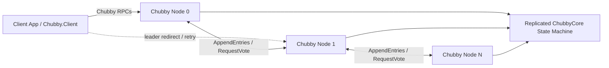

# Distributed-Lock-Service-Chubby

`Chubby` is a .NET 8 implementation of a Chubby-style distributed lock and small-file service backed by a custom Raft implementation. The solution includes:

- a gRPC server that hosts both the Chubby API and the Raft peer-to-peer API
- a replicated in-memory Chubby state machine
- a reusable client package plus a sample console client
- unit and distributed tests for the Raft layer

The current implementation is geared toward local development and experimentation. It already includes leader election, command replication, leader-aware clients, sessions, locks, ACL-backed handles, node contents, sequencers, and failover notifications.

For a code-oriented walkthrough of the consensus layer, see `RAFT_ARCHITECTURE.md`.

## Quick Start

```powershell
dotnet build Raft/Raft.csproj
dotnet build Chubby.Core/Chubby.Core.csproj
dotnet build Chubby.Client/Chubby.Client.csproj
dotnet run --project Chubby -- --nodeId=0
dotnet run --project Chubby -- --nodeId=1
dotnet run --project Chubby -- --nodeId=2
dotnet run --project Chubby -- --nodeId=3
dotnet run --project Chubby -- --nodeId=4
dotnet run --project Chubby.Client
```

The default setup starts a 5-node local cluster on `localhost:5001` through `localhost:5005`, then runs the sample client against it.

## Solution Layout

| Project                   | Purpose                                                                                                                                              |
| ------------------------- | ---------------------------------------------------------------------------------------------------------------------------------------------------- |
| `Chubby/`                 | ASP.NET Core gRPC server. Starts a single Chubby node, hosts the Chubby RPCs and the Raft RPCs, and wires the Raft node to the Chubby state machine. |
| `Chubby.Core/`            | Chubby domain model, replicated state machine, session scheduler, RPC proxy, commands, events, and handle validation logic.                          |
| `Chubby.Client/`          | Client-side abstractions and a sample console app. Includes leader discovery and retry logic for unary RPCs.                                         |
| `Raft/`                   | Custom Raft implementation: node state, replication, voting, persistence interfaces, timers, and message contracts.                                  |
| `Raft.Tests/`             | Unit tests for Raft node behavior.                                                                                                                   |
| `Raft.Distributed.Tests/` | In-process distributed tests for leader election and quorum scenarios.                                                                               |

## Implemented Features

- Raft leader election and log replication
- gRPC APIs for Chubby client traffic and Raft node traffic
- session creation and keep-alive streams
- shared and exclusive locks
- node creation, deletion, content updates, metadata reads, and directory-style child listing
- ACL-aware handles with check-digit validation
- optimistic concurrency for content updates via content generation numbers
- sequencer generation and validation
- leader failover notifications sent through the keep-alive stream
- automatic leader rediscovery in the .NET client for unary RPCs

## High-Level Architecture

1. Each `Chubby` server process starts one Raft node and one Chubby state machine.
2. Client write operations are serialized as Chubby commands and appended through `INodeEnvelope.WriteAsync(...)`.
3. Once Raft commits a log entry, the `ChubbyCore` state machine applies it.
4. Reads and lock operations validate the client handle, session, permissions, and epoch before serving the request.
5. On leader changes, the new leader sends failover events to active sessions and the client can refresh its view of the leader.

### Architecture Diagram



### Main APIs

The Chubby gRPC service is defined in `Chubby/Protos/server.proto` and includes:

- `CreateSession`
- `KeepAlive`
- `Open`
- `Close`
- `Acquire`
- `Release`
- `GetContentsAndStat`
- `GetStat`
- `ReadDir`
- `SetContents`
- `SetAcl`
- `Delete`
- `GetSequencer`
- `CheckSequencer`

The Raft peer protocol is defined in `Chubby/Protos/raft.proto` and includes:

- `AppendEntries`
- `RequestVote`

## Runtime Model

### Sessions and Epochs

- `CreateSession` returns a `session_id` and an `epoch_number`.
- Every request after `CreateSession` is expected to include the `epoch` request header.
- The server rejects requests sent to a follower and returns the known leader address in the gRPC error detail when available.

### Handles

- `Open` returns a `ClientHandle`.
- The handle contains path, instance number, permission, session id, subscribed events, and a check digit.
- The check digit is validated on later requests to detect tampering or stale handles.

### Failover and KeepAlive

- Sessions are maintained through the duplex `KeepAlive` stream.
- Keep-alive responses can carry:
  - failover-related events
  - cache invalidation notifications
  - lease-about-to-expire warnings
- The sample client demonstrates basic request flow, but it does not implement a long-running keep-alive loop for a persistent session.

## Configuration

### Server

`Chubby/appsettings.json` contains the default local cluster configuration:

```json
{
  "RaftConfiguration": {
    "ElectionTimeoutMinMs": 5000,
    "ElectionTimeoutMaxMs": 10000,
    "HeartbeatIntervalMs": 500,
    "ClusterSize": 5,
    "Peers": {
      "0": "http://localhost:5001",
      "1": "http://localhost:5002",
      "2": "http://localhost:5003",
      "3": "http://localhost:5004",
      "4": "http://localhost:5005"
    }
  },
  "ChubbyConfiguration": {
    "LeaseTimeout": 12000,
    "SessionExpiryTimeout": 60000,
    "Threshold": 1000,
    "EphemeralNodeCleanupTimeout": 60000
  }
}
```

Important notes:

- `nodeId` is not stored in `appsettings.json`; it is supplied at process start.
- Each node binds to the port for its `nodeId` from `RaftConfiguration:Peers`.
- Logging is written to the console and to `logs/node-<nodeId>.log`.
- The server currently uses `InMemoryDataSource`, so state is not durable across process restarts.

### Client

`Chubby.Client/appsettings.json` contains:

- the seed node addresses under the `Chubby` section
- the sample client identity under `Client:Name`

The client library normalizes the configured addresses, picks an initial seed node, and retries unary calls when the leader changes.

## Prerequisites

- .NET 8 SDK
- enough terminals or process runners to start the configured number of nodes

## Building

Build the main projects from the repository root:

```powershell
dotnet build Raft/Raft.csproj
dotnet build Chubby.Core/Chubby.Core.csproj
dotnet build Chubby.Client/Chubby.Client.csproj
dotnet build Chubby/Chubby.csproj
```

## Running the Default Local Cluster

The default configuration expects **5 nodes** on `localhost:5001` through `localhost:5005`.

Start each node in its own terminal:

```powershell
dotnet run --project Chubby -- --nodeId=0
dotnet run --project Chubby -- --nodeId=1
dotnet run --project Chubby -- --nodeId=2
dotnet run --project Chubby -- --nodeId=3
dotnet run --project Chubby -- --nodeId=4
```

If you want a smaller cluster, update both:

- `Chubby/appsettings.json`
- `Chubby.Client/appsettings.json`

Make sure `ClusterSize`, the `Peers` map, and the client seed addresses stay aligned.

## Running the Sample Client

Once at least one node has become leader, start the sample client:

```powershell
dotnet run --project Chubby.Client
```

## Using the Client Library

The client library exposes `AddChubbyClient(...)` for dependency injection:

```csharp
var builder = Host.CreateApplicationBuilder(args);
builder.Services.AddChubbyClient(builder.Configuration);
```

That registration provides:

- `IChubby`
- leader endpoint tracking
- channel pooling
- leader discovery and retry logic for unary RPCs

## Testing

The current automated coverage in this repository is centered on the Raft layer.

Run the unit tests:

```powershell
dotnet test Raft.Tests/Raft.Tests.csproj
```

Run the distributed leader-election tests:

```powershell
dotnet test Raft.Distributed.Tests/Raft.Distributed.Tests.csproj
```

`Raft.Tests` covers behavior such as:

- follower-to-candidate transitions
- vote granting and rejection
- leader election
- heartbeat signaling
- log append and commit progression

`Raft.Distributed.Tests` exercises scenarios such as:

- at-most-one-leader election
- leader replacement after disconnect
- quorum loss and recovery
- repeated partition and reconnection cycles

## Current Limitations

This repository is not a finished production Chubby implementation yet. A few important gaps are visible in the current code:

- the server uses in-memory persistence, so restarting nodes loses durable state
- `Close` is still stubbed and does not yet invoke full close logic
- `Open` has a TODO around ACL enforcement when opening existing nodes
- read-path linearizability is still called out as an open concern in `ChubbyRpcProxy`
- Chubby-specific end-to-end tests are not present yet

## Useful Files

- `Chubby/Program.cs` - server startup, gRPC registration, Raft node bootstrapping, and Kestrel configuration
- `Chubby/Services/ChubbyService.cs` - Chubby gRPC service implementation
- `Chubby/Services/NodeService.cs` - Raft gRPC service implementation
- `Chubby.Core/Src/Rpc/ChubbyRpcProxy.cs` - request handling, permission checks, session management, and failover behavior
- `Chubby.Core/Src/StateMachine/ChubbyCore_1.cs` - replicated command application logic
- `Chubby.Client/Core/LeaderDiscoveryInterceptor.cs` - client-side leader redirect and retry behavior
- `Chubby/Protos/server.proto` - Chubby public RPC contract
- `Chubby/Protos/raft.proto` - Raft peer RPC contract
- `RAFT_ARCHITECTURE.md` - implementation-oriented guide to the Raft subsystem

## Status

The codebase is a solid foundation for experimenting with:

- Chubby-style handles, locks, and sessions
- Raft-backed state-machine replication
- client leader discovery over gRPC
